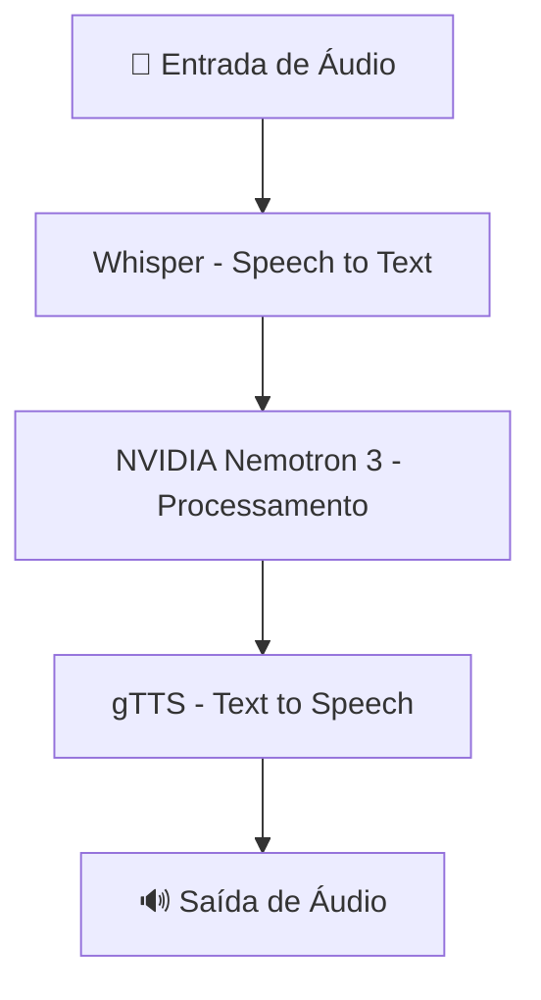

# 🎙️ Conversando por Voz com NVIDIA Nemotron 3 + Whisper

Projeto desenvolvido como parte de um desafio de Bootcamp, com foco em **Inteligência Artificial aplicada à comunicação por voz**, integrando tecnologias modernas de **Speech-to-Text, NLP e Text-to-Speech**.

---

## 📌 Sobre o Projeto

Este projeto implementa um sistema capaz de:

- Captar áudio do usuário 🎤  
- Converter fala em texto (Speech-to-Text)  
- Processar e gerar respostas com IA 🤖  
- Converter texto em voz (Text-to-Speech) 🔊  

A solução utiliza o modelo **Whisper (OpenAI)** para reconhecimento de fala e o **NVIDIA Nemotron 3** para geração de respostas inteligentes, criando uma experiência completa de interação por voz.

---

## 🚀 Tecnologias Utilizadas

- Python
- JavaScript (Web API MediaDevices)
- Whisper (OpenAI)
- NVIDIA Nemotron 3 API
- gTTS (Google Text-to-Speech)
- Machine Learning / IA

---

## 🧠 Conceitos Aplicados

- Reconhecimento Automático de Fala (ASR)
- Processamento de Linguagem Natural (NLP)
- Integração de APIs de IA
- Conversão multimodal (voz ↔ texto)
- Sistemas inteligentes conversacionais

---

## ⚙️ Arquitetura da Solução



---

## 🧩 Etapas do Desenvolvimento

### 1️⃣ Captura de Áudio

- Utilização da Web API MediaDevices para gravação no navegador
- Integração com Python para armazenamento do áudio

### 2️⃣ Reconhecimento de Fala (Whisper)

- Transcrição de áudio para texto
- Suporte a múltiplos idiomas
- Alta precisão mesmo com ruídos e sotaques

### 3️⃣ Integração com NVIDIA Nemotron 3

- Processamento da entrada do usuário
- Geração de respostas inteligentes

### 4️⃣ Conversão de Texto em Voz

- Uso da biblioteca gTTS
- Geração de áudio no idioma desejado

---

## 🎯 Funcionalidades

- Conversação por voz em tempo real  
- Tradução entre idiomas  
- Respostas inteligentes com IA  
- Experiência completa de áudio  

---

## 💡 Possíveis Aplicações

- Assistentes virtuais  
- Automação residencial  
- Acessibilidade  
- Educação  
- Tradução simultânea  

---

## 📂 Estrutura do Projeto

```bash
📁 projeto-voz-ia
│-- main.py
│-- app.js
│-- audio/
│-- outputs/
│-- requirements.txt
│-- README.md
```

---

## ▶️ Como Executar

```bash
git clone https://github.com/seu-usuario/seu-repositorio.git
cd seu-repositorio
pip install -r requirements.txt
python main.py
```

---

## 🔐 Pré-requisitos

- Python 3.8+
- APIs configuradas
- Navegador compatível

---

## 🧑‍💻 Autor

Tiago Almeida  
Analista de Dados | BI | Machine Learning  

---

## 📢 Considerações Finais

Projeto focado na construção de soluções de IA conversacional integrando múltiplas tecnologias modernas.
